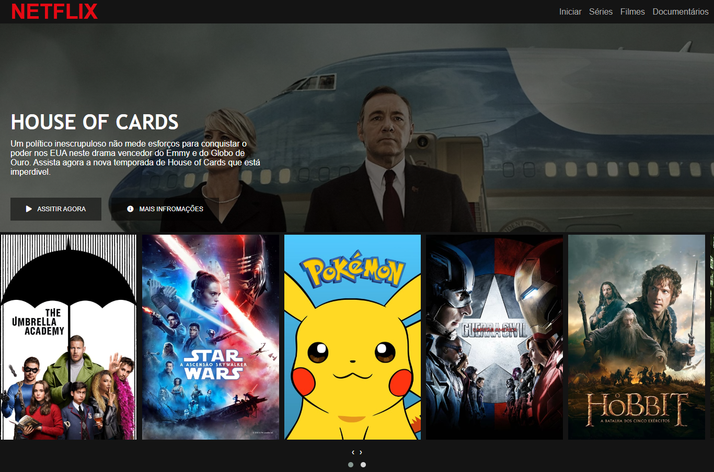

<h1 align="center">
    
Clone: interface da Netflix

</h1>

  <a href="#-tecnologias">Tecnologias</a>&nbsp;&nbsp;&nbsp;|&nbsp;&nbsp;&nbsp;
  <a href="#-projeto">Projeto</a>&nbsp;&nbsp;&nbsp;|&nbsp;&nbsp;&nbsp;
  <a href="#-layout">Layout</a>&nbsp;&nbsp;&nbsp;|&nbsp;&nbsp;&nbsp;

 

## 🚀 Tecnologias

Esse projeto foi desenvolvido com as seguintes tecnologias:

- HTML
- CSS
- JavaScript

## 💻 Projeto

Disponibilizado em um curso pela Digital Innovation One, recriei a interface do principal site de streaming mundial utilizando tecnologias como HTML5, CSS3 e JavaScript. Nesse projeto aprendi: como estruturar um layout, técnicas de CSS3 com containers e variáveis, como posicionar os elementos com Flexbox e como utilizar plugins Jquery a favor da aplicação.

## 🔖 Layout

    

## Versão Web:

 
    
 

---

